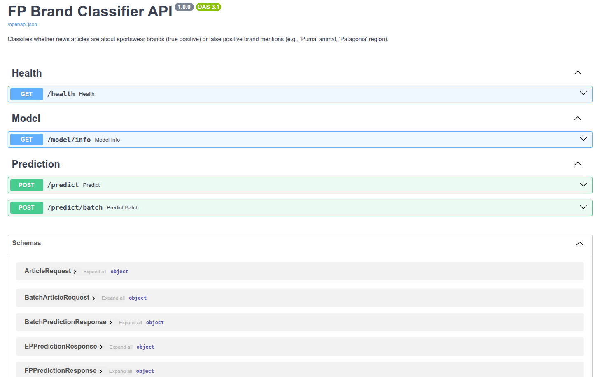
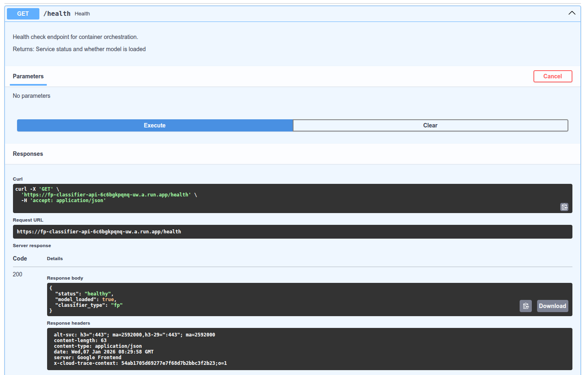
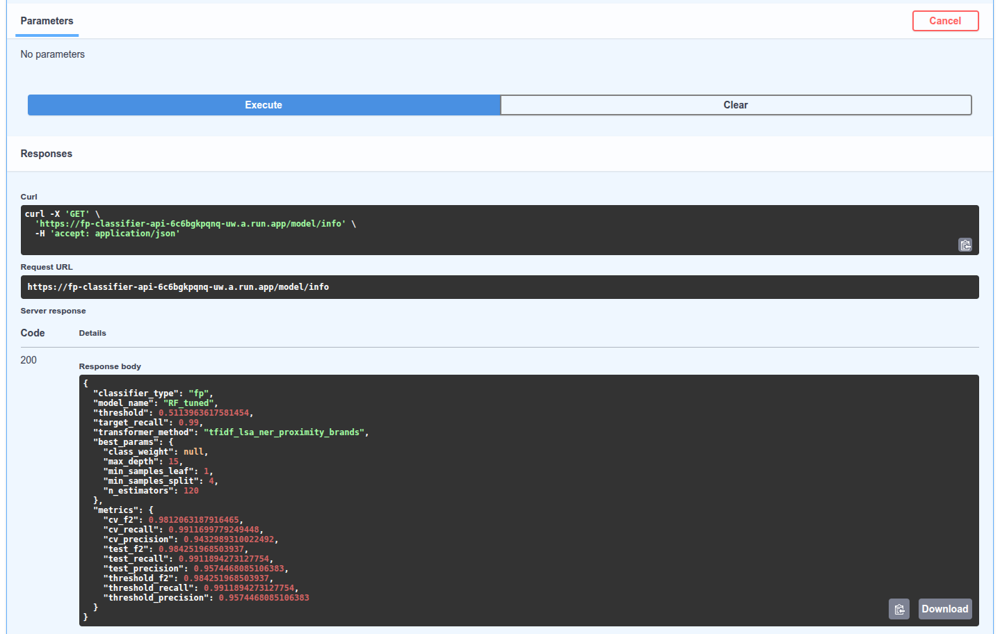
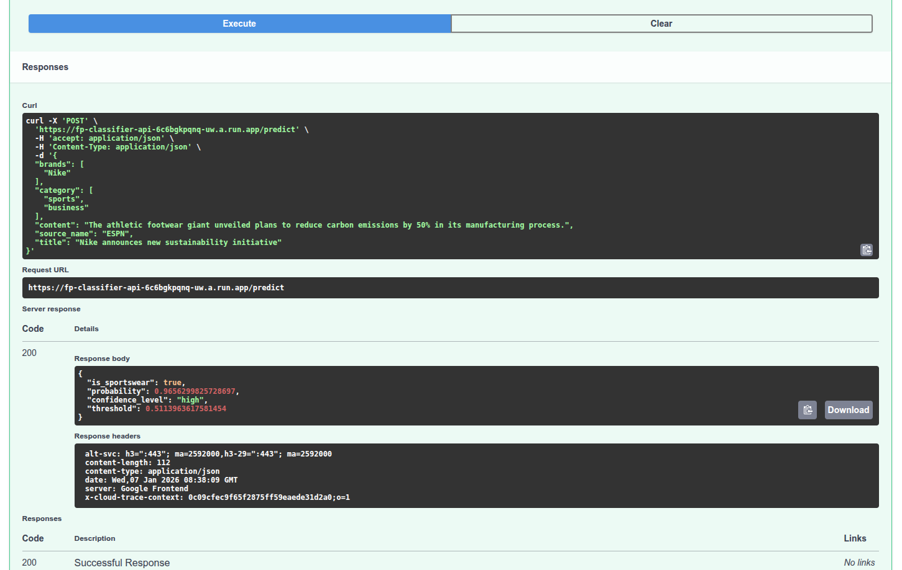

# ML Zoomcamp Reviewer Guide

This guide provides step-by-step instructions for ML Zoomcamp reviewers to evaluate the FP (False Positive) classifier, which is the primary ML component of this project.

**What you'll evaluate:**
1. Training data and exploratory analysis (notebooks)
2. Model training pipeline (CLI script)
3. Local API deployment (FastAPI)
4. Containerized deployment (Docker)
5. Cloud deployment (Google Cloud Run)

> **Note:** This project uses text-based feature engineering techniques (TF-IDF, sentence embeddings, named entity recognition) that were not covered in the ML Zoomcamp curriculum. For a high-level explanation of these NLP methods, see [Text Feature Extraction Methods](TEXT_FEATURES.md).

## Step 1: Run the Notebooks

The FP classifier is developed through a 3-notebook pipeline. Training data is included in the repository. Note that the fp1 and fp2 notebooks can take a long time to run (10-20 minutes). In the fp1 notebook, comment out the `doc2vec_ner_brands` feature engineering method in the fe_configs dict to reduce the runtime. In the fp2 notebook, reduce the hyperparameter grid values for the HistGradientBoosting Tuning method to reduce its runtime.

```bash
# Clone and setup
git clone https://github.com/frederick-douglas-pearce/sportswear-esg-news-classifier.git
cd sportswear-esg-news-classifier
uv sync

# Launch Jupyter, paste link in browser
uv run jupyter lab notebooks/
```

**Notebooks to review (in order):**

| Notebook | Purpose | Key Outputs |
|----------|---------|-------------|
| `fp1_EDA_FE.ipynb` | EDA & Feature Engineering | Feature transformer, hyperparameter tuning |
| `fp2_model_selection_tuning.ipynb` | Model Selection & Tuning | Best model (Random Forest), CV metrics |
| `fp3_model_evaluation_deployment.ipynb` | Test Evaluation & Deployment | Threshold optimization, pipeline export |

**Training data:** `data/fp_training_data.jsonl` (1,340 articles: 1,089 sportswear, 251 false positives)

**Key metrics to look for:**
- CV F2 Score: ~0.98
- Test F2 Score: ~0.97
- Test Recall: ~99% (optimized for high recall to minimize false negatives)

## Step 2: Train with CLI

After reviewing the notebooks, train the model using the CLI script:

```bash
# Train FP classifier (uses config exported from fp2 notebook)
uv run python scripts/train.py --classifier fp --verbose

# Expected output:
# ============================================================
# FP CLASSIFIER TRAINING
# ============================================================
# [1/7] Loading training data...
# [2/7] Creating text features...
# [3/7] Splitting data...
# [4/7] Fitting feature transformer...
# [5/7] Training RandomForest classifier...
# [6/7] Evaluating on test set...
# [7/7] Optimizing threshold for 99% recall...
# ============================================================
# TRAINING COMPLETE
# ============================================================
```

**Outputs:**
- `models/fp_classifier_pipeline.joblib` - Trained sklearn pipeline
- `models/fp_classifier_config.json` - Model configuration and metrics

## Step 3: Local API Deployment

Deploy the trained model as a FastAPI service:

```bash
# Start the FP classifier API
CLASSIFIER_TYPE=fp uv run python scripts/predict.py

# Expected output:
# Starting FP classifier API on port 8000
# Loaded FP classifier
# Model: RF_tuned
# Threshold: 0.5000
```

**Test the API:**

```bash
# Health check
curl http://localhost:8000/health
# {"status":"healthy","model_loaded":true,"classifier_type":"fp"}

# Model info
curl http://localhost:8000/model/info

# Test prediction (sportswear article - should return is_sportswear: true)
curl -X POST http://localhost:8000/predict \
  -H "Content-Type: application/json" \
  -d '{
    "title": "Nike announces new sustainability initiative",
    "content": "The athletic footwear giant unveiled plans to reduce carbon emissions.",
    "brands": ["Nike"]
  }'

# Test prediction (false positive - should return is_sportswear: false)
curl -X POST http://localhost:8000/predict \
  -H "Content-Type: application/json" \
  -d '{
    "title": "Puma spotted in California mountains",
    "content": "Wildlife officials confirmed a mountain lion sighting near hiking trails.",
    "brands": ["Puma"]
  }'
```

**API Documentation:** http://localhost:8000/docs (Swagger UI)

## Step 4: Docker Deployment

Deploy the classifier using Docker Compose:

```bash
# Build and start the FP classifier container
docker compose build fp-classifier-api
docker compose up -d fp-classifier-api

# Check container status
docker ps

# Test health endpoint
curl http://localhost:8000/health

# View logs
docker logs fp-classifier-api

# Stop the container
docker compose down fp-classifier-api
```

**Docker implementation details:**
- Multi-stage build for minimal image size
- Auto-detects dependencies from model config (sentence-transformers, spaCy, etc.)
- Health check endpoint for container orchestration
- See `Dockerfile` and `docker-compose.yml` for configuration

## Step 5: Cloud Deployment

The FP classifier is deployed to **Google Cloud Run** for production use.

**Deployment Architecture:**

```
GitHub Actions (CI/CD)
         │
         ▼
┌─────────────────────────────┐
│   Google Cloud Run          │
│   ├── fp-classifier-api    │
│   │   ├── /health           │
│   │   ├── /model/info       │
│   │   ├── /predict          │
│   │   └── /predict/batch    │
│   └── (2GB memory, 300s timeout)
└─────────────────────────────┘
```

**Live API:** The deployed API URL is available in the screenshots.

**Deployment Screenshots:**

*Screenshots demonstrating the deployed Cloud Run API:*

<details>
<summary>Click to view Cloud Run deployment screenshots</summary>

**Swagger UI Documentation:**



**Health Response:**




**Model Info Response:**



**Example Prediction:**



</details>

> **Note:** Click arrow. If screenshots are not visible, check fp_classifier_gcr_*.png files in images folder.

**Deployment Documentation:**

For detailed CI/CD setup instructions, see [`.github/DEPLOYMENT_SETUP.md`](../.github/DEPLOYMENT_SETUP.md), which covers:
- Required GitHub Secrets (`GCP_PROJECT_ID`, `GCP_SA_KEY`)
- Service account creation with Cloud Run Admin role
- Manual workflow dispatch and `retrain.py` integration
- Verifying deployment with `gcloud` CLI

**GitHub Actions Workflow:**

Deployment is managed via `.github/workflows/deploy.yml`:
- **Manual trigger**: Use "Run workflow" in GitHub Actions UI to deploy `fp`, `ep`, or `all`
- **Automated via retrain.py**: After major/minor version promotion, `retrain.py --auto-promote` triggers deployment
- **Patch versions skipped**: Only major/minor versions trigger redeployment (patches update model files only)
